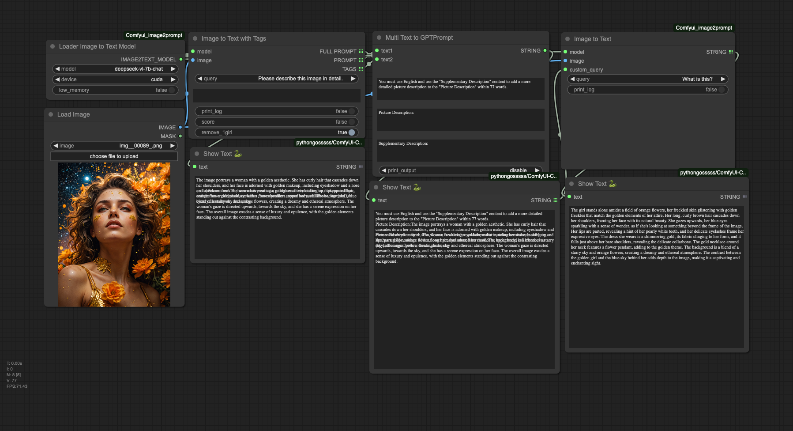
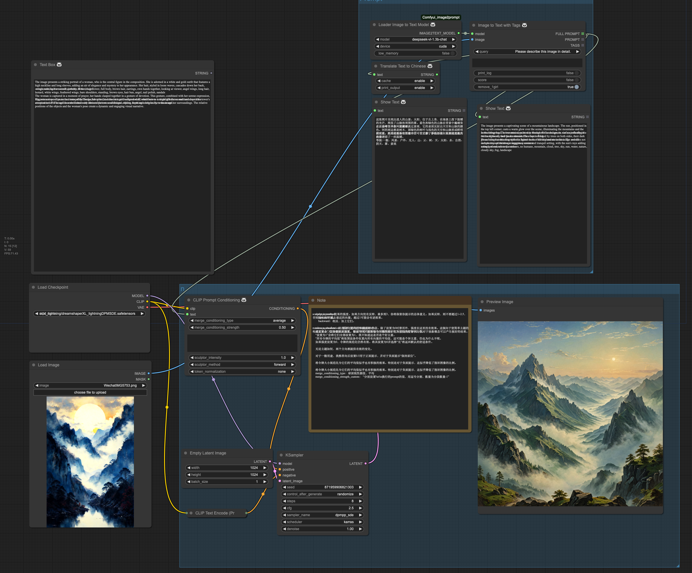
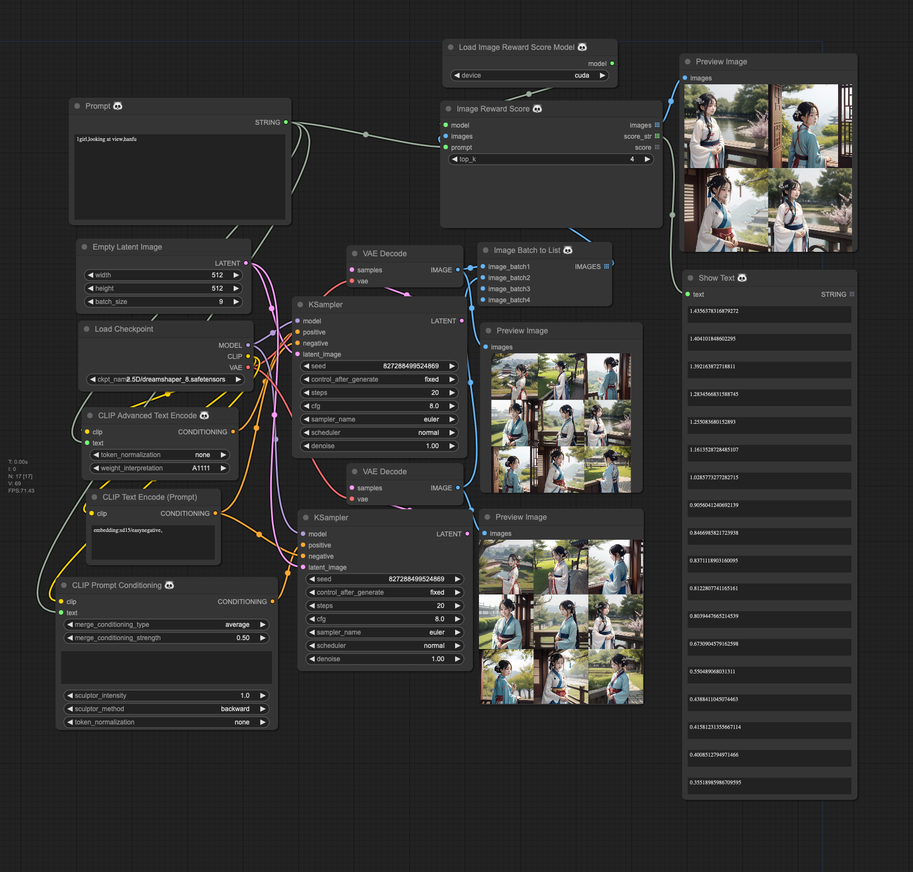

### Base(基础流程)


### 7B model (7B模型流程)


### Compare model (几种文生图模型比较)


### Mix Prompt and Image2prompt (使用图片和文字组合方式)


### Prompt Conditioning (Prompt组合)


### Reward Images (美学评估)


### 介绍


- 我们采用了`wd-swinv2-tagger-v3`模型，显著提升了人物特征的描述准确度，特别适用于需要细腻描绘人物的场景。
- 对于场景描写，`moondream1`模型提供了丰富的细节，但有时候可能显得冗长并缺乏准确性。相比之下，`moondream2`模型以其简洁而精确的场景描述脱颖而出。因此，在使用`Image2TextWithTags`节点时，对于以场景为主的文本生成，推荐`moondream1`与`wd-swinv2-tagger-v3`的组合；而对于注重人物描述的内容，`wd-swinv2-tagger-v3`与`moondream2`的搭配将是理想选择。
- `Text2GPTPrompt`节点旨在创造高效的Prompt，该Prompt能够融合`moondream`系列模型和`wd-swinv2-tagger-v3`产生的关键词，为7b级别的模型定制，内含`qwen1.5-7b`和`deepseek-ai/deepseek-vl-7b-chat`。
- 利用`hahahafofo/Qwen-1_8B-Stable-Diffusion-Prompt`模型，我们能够充分发挥Qwen的潜力，特别是在生成包括古诗词在内的各式提示语时展现卓越性能。此模型经过35000条数据的特定任务微调(SFT)，不仅性价比高，而且在CPU上运行的速度也相当可观。
- Prompt组合方式生成Conditioning （code modify from https://github.com/Extraltodeus/Vector_Sculptor_ComfyUI）
- Reward Images (美学评估)(https://github.com/THUDM/ImageReward)
- 支持 [roborovski/superprompt-v1](https://huggingface.co/roborovski/superprompt-v1) 等T5模型


### 第1步：安装插件

为了在ComfyUI中使用图片转换为提示（prompt）的功能，首先需要将插件的仓库克隆到您的ComfyUI `custom_nodes` 目录中。使用下面的命令来克隆仓库：

```bash
git clone https://github.com/zhongpei/Comfyui-image2prompt
```

完成这一步骤，您就可以在ComfyUI环境中启用此插件，从而高效地将图片转换为描述性提示。

### 第2步：下载模型

模型在第一次运行时候会自动下载，如果没有正常下载，为了使插件正常工作，您需要下载必要的模型。该插件使用来自Hugging Face的 `vikhyatk/moondream1` `vikhyatk/moondream2` `BAAI/Bunny-Llama-3-8B-V` `unum-cloud/uform-gen2-qwen-500m` 和 `internlm/internlm-xcomposer2-vl-7b` 模型。
确保您已将这些模型下载到插件的 `ComfyUI/models/image2text` 目录中。使用以下链接进行下载：

* [下载moondream1模型](https://huggingface.co/vikhyatk/moondream1)
* [下载moondream2模型](https://huggingface.co/vikhyatk/moondream2)
* [下载internlm-xcomposer2-vl-7b模型](https://huggingface.co/internlm/internlm-xcomposer2-vl-7b)
* [下载uform-gen2-qwen-500m模型](https://huggingface.co/unum-cloud/uform-gen2-qwen-500m)
* [下载Qwen-1_8B-Stable-Diffusion-Prompt](https://huggingface.co/hahahafofo/Qwen-1_8B-Stable-Diffusion-Prompt)
* [下载deepseek-ai/deepseek-vl-1.3b-chat](https://huggingface.co/deepseek-ai/deepseek-vl-1.3b-chat)
* [下载deepseek-ai/deepseek-vl-7b-chat](https://huggingface.co/deepseek-ai/deepseek-vl-7b-chat)
此外，如果您更喜欢使用镜像站点下载，可以将Hugging Face端点设置为镜像URL。在终端中执行以下命令以使用镜像：

```bash
export HF_ENDPOINT=https://hf-mirror.com
huggingface-cli download --resume-download vikhyatk/moondream1 --local-dir ComfyUI/models/image2text/moondream1
huggingface-cli download --resume-download internlm/internlm-xcomposer2-vl-7b --local-dir ComfyUI/models/image2text/internlm-xcomposer2-vl-7b
huggingface-cli download --resume-download unum-cloud/uform-gen2-qwen-500m --local-dir ComfyUI/models/image2text/uform-gen2-qwen-500m
```

按照这些步骤操作，您将确保插件能够访问所需的模型，从而准确地将图片转换为提示，增强您的ComfyUI体验。

# English


- We adopted the `wd-swinv2-tagger-v3` model, which significantly enhanced the accuracy of character trait descriptions, making it particularly suitable for scenarios requiring detailed depiction of characters.
- For scene description, the `moondream1` model offers rich details but might sometimes appear verbose and lack precision. In contrast, the `moondream2` model stands out for its concise and accurate scene descriptions. Therefore, when using the `Image2TextWithTags` node, for text generation centered on scenes, a combination of `moondream1` and `wd-swinv2-tagger-v3` is recommended; for content focusing on character descriptions, pairing `wd-swinv2-tagger-v3` with `moondream2` is the ideal choice.
- The `Text2GPTPrompt` node is designed to create efficient prompts that can integrate keywords generated by the `moondream` series models and `wd-swinv2-tagger-v3`, customized for models at the 7b level, including `qwen1.5-7b`.
- Utilizing the `hahahafofo/Qwen-1_8B-Stable-Diffusion-Prompt` model, we can fully leverage the potential of Qwen, especially in generating various forms of prompts, including classical poetry. This model, fine-tuned with 35,000 pieces of data for specific tasks (SFT), not only offers a high cost-performance ratio but also runs at a considerable speed on CPUs.
- Generating Conditioning through Prompt Combination （code modify from https://github.com/Extraltodeus/Vector_Sculptor_ComfyUI）
- Reward Images (https://github.com/THUDM/ImageReward)
- Support T5 models such as [roborovski/superprompt-v1](https://huggingface.co/roborovski/superprompt-v1)

### Step 1: Install the Plugin

To integrate the Image-to-Prompt feature with ComfyUI, start by cloning the repository of the plugin into your ComfyUI `custom_nodes` directory. Use the following command to clone the repository:

```bash
git clone https://github.com/zhongpei/Comfyui-image2prompt
```

This step is crucial for enabling the plugin within the ComfyUI environment, facilitating the efficient transformation of images into descriptive prompts.

### Step 2: Download the Model

The model will be automatically downloaded the first time it is run. If it does not download normally, for the plugin to function properly, you need to download the necessary models. This plugin utilizes the `vikhyatk/moondream1` `vikhyatk/moondream2` `unum-cloud/uform-gen2-qwen-500m` and `internlm/internlm-xcomposer2-vl-7b` models from Hugging Face. Make sure to download these models into the plugin's `ComfyUI/models/image2text` directories, respectively. Use the following links for downloading:

* [Download moondream1 Model](https://huggingface.co/vikhyatk/moondream1)
* [Download moondream2 Model](https://huggingface.co/vikhyatk/moondream2)
* [Download internlm-xcomposer2-vl-7b Model](https://huggingface.co/internlm/internlm-xcomposer2-vl-7b)
* [Download uform-gen2-qwen-500m Model](https://huggingface.co/unum-cloud/uform-gen2-qwen-500m)
* [Download Qwen-1_8B-Stable-Diffusion-Prompt](https://huggingface.co/hahahafofo/Qwen-1_8B-Stable-Diffusion-Prompt)
* [Download deepseek-vl-1.3b-chat](https://huggingface.co/deepseek-ai/deepseek-vl-1.3b-chat)
* [Download deepseek-ai/deepseek-vl-7b-chat](https://huggingface.co/deepseek-ai/deepseek-vl-7b-chat)
Additionally, if you prefer using a chinese mirror site for downloading, you can set the Hugging Face endpoint to a mirror URL. Execute the following commands in your terminal to utilize the mirror:

```bash

huggingface-cli download --resume-download vikhyatk/moondream1 --local-dir ComfyUI/models/image2text/moondream1
huggingface-cli download --resume-download vikhyatk/moondream2 --local-dir ComfyUI/models/image2text/moondream2
huggingface-cli download --resume-download internlm/internlm-xcomposer2-vl-7b --local-dir ComfyUI/models/image2text/model/internlm-xcomposer2-vl-7b
huggingface-cli download --resume-download unum-cloud/uform-gen2-qwen-500m --local-dir ComfyUI/models/image2text/model/uform-gen2-qwen-500m
```

By completing these steps, you'll ensure that the plugin has access to the necessary models, enabling it to accurately convert images into prompts, thereby enhancing your ComfyUI experience.