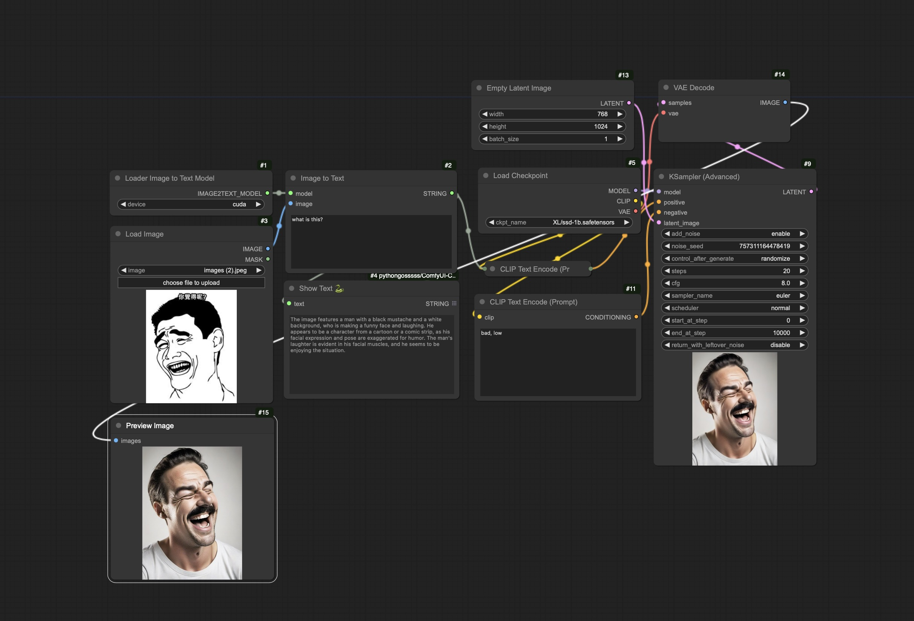

### 第1步：安装插件

最后，将本插件存储库克隆到您的ComfyUI custom_nodes目录中。使用以下命令克隆存储库：

```

git clone https://github.com/zhongpei/Comfyui-image2prompt

```

### 第2步：下载模型

首先，请从以下载 https://huggingface.co/vikhyatk/moondream1 到插件的model目录


可以使用镜像，请在终端中执行以下命令：


```

export HF_ENDPOINT=https://hf-mirror.com
huggingface-cli download --resume-download vikhyatk/moondream1 --local-dir custom_nodes/Comfyui-image2prompt/model

```



### Step 1: Install the Plugin

To use the image-to-prompt feature in ComfyUI, first clone the plugin repository into your ComfyUI `custom_nodes` directory. You can clone the repository using the following command:

```bash
git clone https://github.com/zhongpei/Comfyui-image2prompt
```

This step will enable you to utilize the plugin within the ComfyUI environment, enhancing your efficiency in processing images and converting them into prompts.

### Step 2: Download the Model

Before using the plugin, you need to download the required model. The plugin uses the `vikhyatk/moondream1` model from Hugging Face. Ensure that you have downloaded the model to the plugin's `model` directory from the following link:

[Model Download Link](https://huggingface.co/vikhyatk/moondream1)


By following these steps, you will ensure that the plugin can correctly access and use the model, providing accurate image-to-prompt conversion services.


